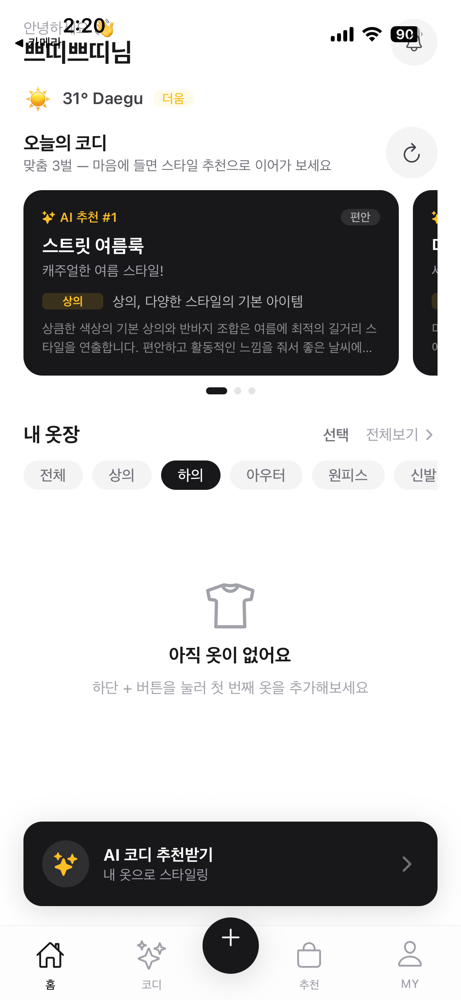
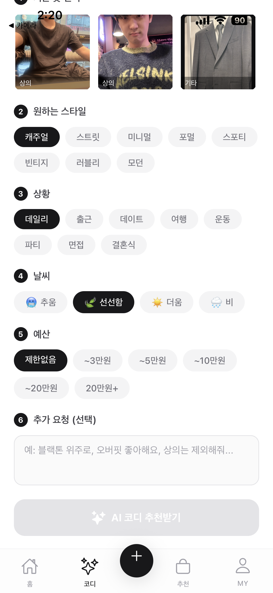
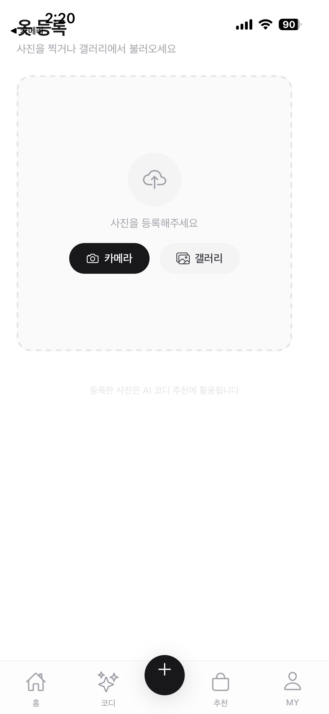
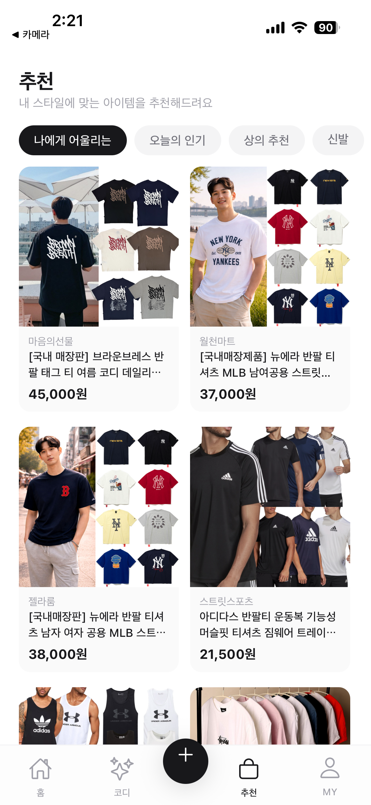
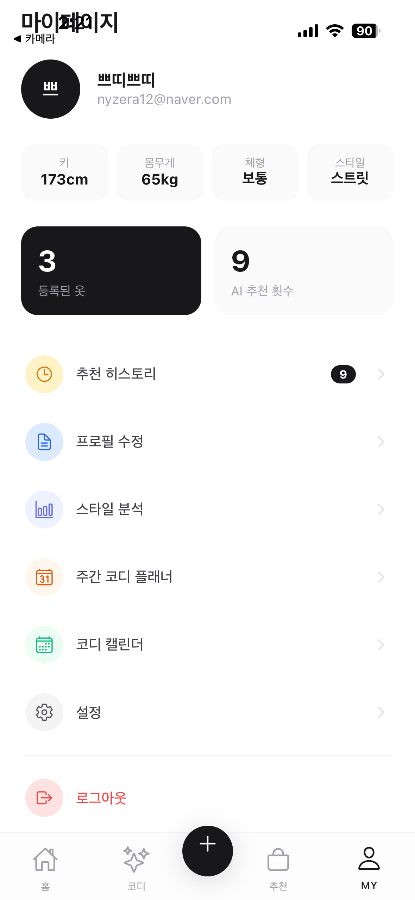

# 🌊 Fizzylush AI Office

> AI가 대신 일해주는 패션 앱 운영 시스템

바이브코딩으로 혼자 만든 AI 패션 앱 **fizzylush**와, 그 앱을 운영하는 **AI 직원 10명짜리 가상 사무실**입니다.

---

## 이게 뭔가요?

크게 두 가지 프로젝트가 합쳐져 있습니다.

### 1. fizzylush — AI 패션 앱

내 옷 사진을 등록하면 AI가 오늘 날씨에 맞는 코디를 추천해주고, 쇼핑까지 연결해주는 모바일 앱입니다.

### 2. AI Office — AI 직원 오피스

박기획, 이리서치, 오개발 등 10명의 AI 직원이 실제로 기획서 작성, 경쟁사 분석, 마케팅 문구 작성 등의 업무를 수행합니다. 창업자(나)는 지시만 내리면 됩니다.

---

## 앱 화면

<div align="center">
  
  
  
  
  
</div>

| 홈 화면 | AI 코디 추천 | 옷 목록 | 쇼핑 추천 | 마이페이지 |
|:---:|:---:|:---:|:---:|:---:|
| 오늘 날씨 + 코디 3벌 | 스타일·상황 선택 | 내 옷 등록 | AI 추천 쇼핑 | 키·몸무게·스타일 |

---

## fizzylush 앱 기능 전체

| 기능 | 어떻게 동작하나요? |
|---|---|
| **홈 - 일일 코디 3벌** | 앱을 켜면 오늘 날씨를 자동으로 읽어서, 내 옷장에서 어울리는 코디를 AI가 3벌 추천해줍니다 |
| **AI 코디 추천** | 원하는 스타일(캐주얼/포멀 등), 상황(데이트/출근 등), 날씨, 예산을 고르면 AI가 맞춤 코디를 만들어줍니다 |
| **옷 등록** | 카메라나 갤러리에서 옷 사진을 찍으면 AI가 어떤 카테고리인지(상의/하의 등) 자동으로 분류합니다 |
| **가상 피팅** | 내 체형 정보(키/몸무게)를 입력하면 AI가 나랑 비슷한 아바타를 만들고, 그 아바타에 옷을 입혀서 보여줍니다 |
| **쇼핑 추천** | AI가 추천한 아이템을 네이버 쇼핑에서 자동으로 검색해서 구매 링크까지 보여줍니다 |
| **스타일 분석** | 내 옷장의 카테고리 분포, 자주 입는 스타일 등을 AI가 분석해서 진단해줍니다 |
| **주간 코디 플래너** | 이번 주 7일치 코디 계획을 AI가 자동으로 짜줍니다 |
| **코디 캘린더** | 오늘 뭐 입었는지 날짜별로 기록할 수 있습니다 |
| **추천 히스토리** | 이전에 받은 AI 추천을 다시 볼 수 있고, 좋아요/별로 피드백을 주면 다음 추천에 반영됩니다 |

---

## AI Office — 픽셀 오피스 대시보드

브라우저에서 열면 이런 화면이 나옵니다:

```
┌─ FIZZYLUSH AI OFFICE ─────────────────────────────── ! 4 승인 대기 ─┐
│                                                                      │
│  [책장🗄️] [책장] [책장] [책장] [책장] [책장] [책장] [식물🌿]        │
│                                                                      │  ▶ BOSS TERMINAL
│  박기획🧑  이리서치👩  김번역👨  최분석👩  정총무🧑                  │
│  [책상💻] [책상💻]  [책상💻]  [책상💻]  [책상💻]                    │  BOSS> 이번 주
│                                                                      │         마케팅 전략
│  오개발👨  한검수👩  서배포🧑  임집행👨  유법무👩                    │         짜줘
│  [책상💻] [책상💻]  [책상💻]  [책상💻]  [책상💻]                    │
│                                                                      │  [ 지시 하달 ]
├── ● 박기획 DONE  ● 이리서치 DONE  ● 오개발 DONE  ● 서배포 IDLE ───  │
└──────────────────────────────────────────────────────────────────────┘
```

- 직원들이 실제로 책상에 앉아서 일합니다 (픽셀 아트 애니메이션)
- 내가 오른쪽 터미널에 지시를 내리면 AI 직원들이 실행합니다
- 승인이 필요한 작업(스토어 제출, 광고 집행 등)은 내가 직접 버튼을 눌러야 합니다
- 각 직원 상태가 실시간으로 표시됩니다 (IDLE / WORKING / AWAITING 승인 / DONE)

---

## AI 직원 10명 소개

> 이 직원들은 실제로 OpenAI GPT-4o를 기반으로 동작합니다. 이름과 역할이 있고, 서로 협업도 합니다.

| 이름 | 담당 | 하는 일 |
|---|---|---|
| **박기획** | 기획 | 사업 계획서, 제품 로드맵, 기능 기획서 작성 |
| **이리서치** | 리서치 | 경쟁 앱 분석, 시장 조사, 트렌드 리포트 |
| **김번역** | 마케팅 | 앱스토어 설명문구, SNS 카피, 영어 번역 |
| **최분석** | 분석 | 사용자 행동 분석, 지표 해석, 성장 전략 |
| **정총무** | 운영 | 런칭 체크리스트, 일정 관리, 운영 문서 |
| **오개발** | 개발 | 코드 수정 제안, 기술 이슈 분석 |
| **한검수** | QA | 버그 리포트, 테스트 시나리오 작성 |
| **서배포** | 배포 | 앱스토어 제출 준비, 빌드 체크 |
| **임집행** | 마케팅 집행 | 광고 집행 계획, 인플루언서 섭외 전략 |
| **유법무** | 법무 | 개인정보처리방침, 이용약관, 법적 이슈 체크 |

### AI 직원들이 일하는 방식 (4단계)

#### 1단계 — 혼자 생각하면서 일하기 (ReAct 루프)
```
지시를 받음
  → "어떻게 할지 생각" (think)
  → 도구 사용해서 실행 (웹 검색, 파일 읽기 등)
  → 결과 확인
  → 완성될 때까지 반복 (최대 10번)
  → 완료 신호 보내기
```

#### 2단계 — 여러 명이 동시에 일하기 (병렬 실행)
```
"마케팅 전략 짜줘" 라고 지시하면
  → AI 매니저가 어떤 직원들이 필요한지 판단
  → 박기획 + 이리서치 + 김번역을 동시에 실행
  → 서로 모르는 게 있으면 ask_colleague로 물어봄
  → 결과를 합쳐서 최종 보고
```
*참고: 동시에 실행되니까 각자 따로 하면 3배 걸릴 일을 1배 시간에 처리합니다*

#### 3단계 — 자동으로 품질 체크 (자동 평가 + 재시도)
```
직원이 결과물을 제출하면
  → GPT가 1~10점으로 자동 채점
  → 6점 미만이면 "이 부분이 부족해, 다시 해" 피드백 전달
  → 직원이 피드백 반영해서 다시 제출
  → 합격할 때까지 반복
```

#### 4단계 — 알아서 자동으로 실행 (이벤트 트리거)
```
예: "매일 아침 9시에 fizzylush 운영 현황 체크" 라고 설정해두면
  → 매일 9시가 되면 알아서 정총무가 깨어나서 체크하고 보고
  
외부 이벤트(앱 오류, 신규 사용자 급증 등)가 들어오면
  → 해당 이슈를 담당하는 직원이 자동으로 대응
```

---

## 기술적으로 어떻게 만들어졌나요?

솔직히 바이브코딩이라 전부 이해 못해도 됩니다. 그냥 이런 기술들이 쓰였다 정도만 알면 됩니다.

### fizzylush 앱 (PJ01/)
| 뭘로 만들었나 | 역할 |
|---|---|
| **Expo + React Native** | 앱의 기본 틀. iOS/Android 동시 개발 가능 |
| **Firebase** | 로그인(Auth), 데이터 저장(Firestore), 사진 저장(Storage) |
| **OpenAI GPT-4o** | 코디 추천 AI 두뇌 |
| **DALL-E 3** | 가상 피팅용 아바타 이미지 생성 |
| **FAL.ai Kling Kolors** | 아바타에 옷을 입히는 AI |
| **네이버 쇼핑 API** | 상품 검색 |
| **OpenWeatherMap** | 날씨 데이터 |

### AI Office 서버 (server.py)
| 뭘로 만들었나 | 역할 |
|---|---|
| **FastAPI** | API 서버. 앱 ↔ AI Office ↔ 외부 API 중간 다리 |
| **OpenAI GPT-4o-mini** | AI 직원들의 두뇌 |
| **SQLite** | 직원 활동 기록, 토큰 사용량, 문서 저장 |
| **Railway** | 서버 배포 (인터넷에서 접근 가능하게) |

### AI Office 대시보드 (ai-office-design/)
| 뭘로 만들었나 | 역할 |
|---|---|
| **React + Vite** | 웹 대시보드 기본 틀 |
| **Canvas 2D** | 픽셀 아트 사무실 화면 그리기 |
| **pixel-agents 에셋 (MIT)** | 픽셀 캐릭터 스프라이트, 가구 이미지 |
| **Framer Motion** | 애니메이션 효과 |

---

## 폴더 구조

```
ai-office/
│
├── server.py                  ← AI 직원 시스템 + API 프록시 서버 (핵심!)
├── requirements.txt           ← Python 패키지 목록
├── Procfile                   ← Railway에 "이렇게 실행해줘" 설정
│
├── PJ01/                      ← fizzylush 앱 소스코드
│   ├── src/
│   │   ├── screens/           ← 각 화면 (홈, 코디, 추천, MY 등)
│   │   ├── services/          ← API 통신 (OpenAI, Firebase, 네이버 등)
│   │   └── components/        ← 재사용 UI 컴포넌트
│   └── app.json               ← 앱 기본 설정
│
├── ai-office-design/          ← 픽셀 오피스 대시보드 웹 앱
│   ├── src/app/
│   │   ├── App.tsx            ← 대시보드 전체 레이아웃
│   │   └── OfficeRoom.tsx     ← 픽셀 아트 사무실 Canvas 렌더러
│   └── public/assets/         ← 픽셀 캐릭터·가구·바닥 이미지
│
├── docs/screenshots/          ← fizzylush 앱 스크린샷
└── data/                      ← AI 직원 활동 DB (SQLite)
```

---

## 실행 방법

### fizzylush 앱 실행

```bash
cd PJ01
npm install
npx expo start
# → QR 코드를 Expo Go 앱으로 스캔하면 폰에서 실행됩니다
```

### AI Office 서버 실행 (로컬)

```bash
# Python 패키지 설치
pip install -r requirements.txt

# .env 파일에 API 키 설정 후 실행
uvicorn server:app --host 0.0.0.0 --port 8000 --reload
```

### 픽셀 대시보드 실행

```bash
cd ai-office-design
npm install
npm run dev
# → http://localhost:5173 에서 열립니다
# → 단, AI Office 서버가 켜져 있어야 직원 데이터가 보입니다
```

---

## 환경변수 설정

서버를 실행하려면 `.env` 파일을 루트에 만들고 아래 키들을 넣어야 합니다.

```env
# AI 두뇌 (필수)
OPENAI_API_KEY=sk-...

# 대시보드 보안 토큰 (아무 문자열이나 설정)
OFFICE_TOKEN=my-secret-token

# 네이버 쇼핑 검색
NAVER_SHOPPING_CLIENT_ID=
NAVER_SHOPPING_CLIENT_SECRET=

# 날씨
OPENWEATHER_API_KEY=

# 가상 피팅 (FAL.ai)
FAL_API_KEY=

# CORS (비워두면 전체 허용 — 로컬 개발 시 비워도 됨)
CORS_ALLOWED_ORIGINS=
```

앱의 Firebase 설정은 `PJ01/.env`에 따로 넣습니다:

```env
EXPO_PUBLIC_FIREBASE_API_KEY=
EXPO_PUBLIC_FIREBASE_AUTH_DOMAIN=
EXPO_PUBLIC_FIREBASE_PROJECT_ID=
EXPO_PUBLIC_FIREBASE_STORAGE_BUCKET=
EXPO_PUBLIC_FIREBASE_MESSAGING_SENDER_ID=
EXPO_PUBLIC_FIREBASE_APP_ID=
EXPO_PUBLIC_API_BASE_URL=https://web-production-2b5e3.up.railway.app
```

---

## 배포 현황

| 서비스 | 주소 |
|---|---|
| AI Office 서버 | https://web-production-2b5e3.up.railway.app |
| GitHub | https://github.com/HyeonMO01/AI-office |

Railway에 GitHub 연동이 되어 있어서, `git push` 하면 자동으로 서버가 업데이트됩니다.

---

## AI Office API 엔드포인트

> 앱이나 외부에서 AI 직원들에게 명령을 보낼 때 사용하는 주소들입니다

| 주소 | 설명 |
|---|---|
| `POST /command` | AI 직원에게 명령 보내기 (토큰 필요) |
| `GET /office/overview` | 사무실 전체 현황 조회 (직원 상태, 문서, 이벤트 등) |
| `GET /office/jobs` | 자동 반복 업무 목록 |
| `POST /office/actions/{id}/approve` | 승인 대기 작업 승인 |
| `POST /webhook` | 외부 시스템에서 이벤트 전송 |
| `POST /api/openai/chat-completions` | OpenAI 채팅 프록시 (앱에서 사용) |
| `POST /api/openai/image-generation` | DALL-E 3 이미지 생성 (앱에서 사용) |
| `GET /api/naver/shop-search` | 네이버 쇼핑 검색 (앱에서 사용) |
| `GET /api/weather/current` | 날씨 조회 (앱에서 사용) |
| `POST /api/fal/tryon/start` | 가상 피팅 시작 |
| `GET /api/fal/tryon/status` | 가상 피팅 결과 확인 |

---

## 다음 할 일

- [ ] FAL.ai $5 충전 → 가상 피팅 실제 테스트
- [ ] 베타 사용자 30명 모집
- [ ] Apple Developer 계정 ($99) → TestFlight 배포
- [ ] Google Play 계정 ($25) → APK 스토어 등록

---

*혼자 바이브코딩으로 만든 프로젝트입니다. AI 직원들이 실제로 일을 합니다.*
